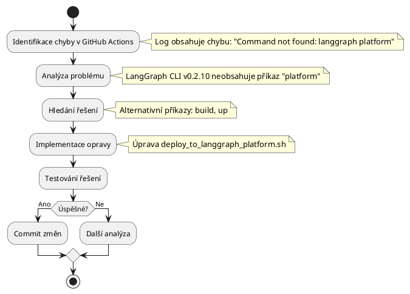

# Instrukce pro Copilota: AI-agent-Ntier Deployment

> **Reference k PlantUML příručkám:** Příručky pro vytváření diagramů najdeš v `/Users/marekminarovic/AI-agent-Ntier/doc/PlantUML/`
> - Diagram_Aktivit.md - Tvorba diagramů aktivit
> - Sekvencni_diagram.md - Tvorba sekvenčních diagramů
> - Diagram_Trid.md - Tvorba diagramů tříd
> - Stavovy_diagram.md - Tvorba stavových diagramů

# AKTUÁLNÍ STAV A ÚKOLY (20.05.2025)

## Aktuální stav projektu
- Aplikace je částečně nasazena do LangGraph Platform
- Základní funkčnost je implementována, ale chybí optimální podpora pro různé typy analýz
- Byla provedena analýza dat v mock_data_2 a porovnána s N8N workflow

## Aktuální úkoly
1. **Implementace podpory pro typy analýz**
   - Přidat rozpoznávání typů analýz: risk_comparison, supplier_analysis, general
   - Implementovat funkci determine_analysis_type() 
   - Upravit retrieve_additional_company_data pro načítání dat podle typu analýzy
   
2. **Úprava zpracování mock dat**
   - Vytvořit mapování mezi typy analýz a soubory v mock_data_2
   - Opravit zpracování dat podle správného typu analýzy
   - Přizpůsobit MockMCPConnector pro práci s různými typy souborů

3. **Optimalizace workflow**
   - Upravit analyze_company_data pro specializované analýzy podle typu
   - Zajistit kompatibilitu s aktuálním workflow v LangGraph Platform

## Provedená analýza
- Vytvořeny dokumenty: N8N_analyzy.md, mock_data_workflow_kompatibilita.md
- Vytvořeny diagramy: N8N_workflow_analyza.puml, optimalizovane_workflow.puml
- Identifikován nesoulad mezi workflow v projektu a strukturou dat v mock_data_2

*Strukturovaný návod s využitím CoT a M-C-P přístupů*
Poznámka: "M-C-P přístup" nemá nic spolecného s "MCP" - (Model Context Protocol), ale je to zkratka pro "Model-Chain-Prompting", což je technika pro efektivní řešení problémů pomocí modelu a řetězení myšlenek. Příklad: "MCP Context7", "MCP sequential thinking" jsou Model Context Protocols servery.

## Plán implementace podpory pro typy analýz (20.05.2025)

### Analýza typů analýz a vhodná prioritizace

**Chain of Thought pro výběr počátečního typu analýzy:**
1. **Prozkoumání dat**: 
   - V mock_data_2 jsou soubory pro různé typy analýz (entity_search_*.json, entity_detail_*.json, relationships_*.json, supply_chain_*.json)
   - Každý typ analýzy využívá rozdílnou kombinaci těchto souborů

2. **Vyhodnocení složitosti implementace**:
   - General analýza: Využívá entity_search_*.json a internal_*.json - nejjednodušší struktura
   - Risk Comparison: Využívá entity_detail_*.json - středně složitá struktura s rizikovými faktory
   - Supplier Analysis: Využívá relationships_*.json a supply_chain_*.json - nejsložitější struktura

3. **Zhodnocení stávajícího kódu**:
   - MockMCPConnector podporuje načítání dat z entity_detail_*.json a relationships_*.json
   - Chybí podpora pro entity_search_*.json a supply_chain_*.json
   - Funkce determine_analysis_type již existuje, ale retrieve_additional_company_data nezohledňuje typ analýzy

4. **Závěr analýzy**:
   - Začít implementací General analýzy jako základu pro další typy
   - Následně implementovat Risk Comparison, kde už existuje část podpory
   - Nakonec implementovat nejsložitější Supplier Analysis

### Inkrementální postup implementace

**Krok 1: General analýza**
- Rozšířit MockMCPConnector o metodu get_company_search_data pro načítání entity_search_*.json
- Upravit retrieve_additional_company_data pro načítání dat podle typu analýzy
- Otestovat s jednoduchými dotazy zaměřenými na obecné informace o společnosti

**Krok 2: Risk Comparison**
- Rozšířit zpracování rizikových faktorů z entity_detail_*.json
- Specializovat analýzu pro vyhodnocování rizik
- Testovat s dotazy zaměřenými na rizikové faktory a compliance

**Krok 3: Supplier Analysis**
- Implementovat podporu pro načítání supply_chain_*.json
- Rozšířit analýzu o zpracování dodavatelských vztahů a řetězce
- Testovat s dotazy zaměřenými na dodavatelské vztahy

## Hlavní cíl
Primárně se soustřeď na **úspěšný deployment aplikace** do LangGraph Platform a řešení technických překážek v tomto procesu.

## Priorita úkolů
PRIORITA: 
1. Oprava chyb v kódu a řešení technických problémů
2. Nasazení kódu na LangGraph Platform
3. Ladění a testování nasazené aplikace
4. Až po úspěšném nasazení se věnuj dokumentaci

**KRITICKÉ:** Nejprve řeš kompletní opravu a nasazení, až následně se věnuj dokumentaci. Dokumentace nemá prioritu - prioritou je funkční nasazení aplikace na LangGraph Platform.

## Správný workflow pro nasazení
DŮLEŽITÉ: Pro nasazení aplikace na LangGraph Platform dodržuj následující postup:

1. **Lokální testování:**
   - Používej `deploy_to_langgraph_platform.sh` pouze pro LOKÁLNÍ testování funkčnosti
   - Používej `verify_deployment.sh` pro kontrolu správnosti kódu
   - NIKDY nepoužívej příkazy jako `langgraph build` nebo `langgraph deploy` při práci s GitHub

2. **Nasazení na GitHub:**
   - Pro nasazení na LangGraph Platform používej VÝHRADNĚ `deploy_to_github.sh`
   - Tento skript odešle ČISTÝ kód na GitHub bez jakýchkoliv Docker souborů
   - LangGraph Platform si stáhne kód přímo z GitHubu a sestaví jej podle `langgraph.json`

3. **Propojení GitHub a LangGraph Platform:**
   - V administraci LangGraph Platform propoj GitHub repozitář
   - Nastav automatické nasazení při push do hlavní větve

**NIKDY NEPOSÍLEJ** Docker soubory a konfiguraci na GitHub, způsobuje to konflikty při buildu na LangGraph Platform!

## Proces řešení problémů (M-C-P)

### 1. Identifikace a analýza chyb (Chain 1)
Při nalezení chyby v GitHub Actions nebo logu:
1. **Identifikace** - Extrahuj přesnou chybovou zprávu
2. **Analýza (CoT)** - Proveď řetězec úvah:
   - Co přesně říká chybová zpráva?
   - V které části procesu se vyskytuje?
   - Jaká je pravděpodobná příčina?
   - Je to jednoduchá syntaktická chyba nebo komplexnější problém?
3. **Návrh řešení** - Definuj konkrétní opravu s vysvětlením
4. **Implementace** - Proveď potřebné změny
5. **Verifikace** - Ověř, že řešení funguje

### 2. Využití Context7 (Chain 2)
```
Pokud jde o komplexní problém:
  HLEDEJ příklady řešení v Context7
  APLIKUJ nalezená řešení s adaptací pro konkrétní situaci
Pokud jde o jednoduchou syntaktickou chybu:
  NEHLEDEJ v Context7
  IMPLEMENTUJ přímé řešení podle logu
```

### 3. Dokumentace v notes.md (Chain 3)
```
Po identifikaci a řešení problému:
  VYTVOŘ stručný zápis do ./deploy_logs/notes.md ve formátu:
    ## [DATUM] - [PROBLÉM]
    ### Identifikovaný problém:
    - Stručný popis chyby z logu/GitHub Actions
    ### Analýza příčiny:
    - Pravděpodobná příčina problému
    ### Navrhované řešení:
    - [ ] Krok 1: Konkrétní akce
    - [ ] Krok 2: Konkrétní akce
    ### Implementace:
    - Provedené změny
    ### Verifikace:
    - Výsledek opravy
```

### 4. Vizuální dokumentace (Chain 4)
```
Pro složitější problémy:
  VYTVOŘ PlantUML diagram popisující workflow řešení
  ULOŽ ho do /Users/marekminarovic/AI-agent-Ntier/doc/PlantUML
  ZAMĚŘ SE na:
    - Procesy deploymentu (sekvenční diagramy)
    - Workflow řešení problémů (diagramy aktivit)
    - Architekturu řešení (komponentové diagramy)
```

## Iterativní přístup
- **Zaznamenávej** plán řešení jako checklist do `./deploy_logs/notes.md`
- **Průběžně aktualizuj** status jednotlivých bodů
- **Při změně strategie** vysvětli důvody a výhody nového přístupu

## Co NEDĚLAT (CoT analýza)
**NEVYTVÁŘEJ** rozsáhlou dokumentaci
> *Proč?* Odvádí pozornost od hlavního cíle - úspěšného deploymentu
> *Důležité!* Dokumentaci vytvoř až PO úspěšném nasazení aplikace

**NEPOSÍLEJ** průběžně dokumentaci a diagramy na GitHub
> *Proč?* Zpomaluje proces a tříští fokus

**NEUPŘEDNOSTŇUJ** dokumentaci před opravou chyb
> *Proč?* Dokumentace bez funkční aplikace nemá žádný přínos

**NIKDY NEPOSÍLEJ** Docker soubory a konfiguraci na GitHub
> *Proč?* Způsobuje konflikty při buildu na LangGraph Platform

**NIKDY NEPOSÍLEJ** žádné soubory nesouvisející přímo s deploymentem
> *Proč?* LangGraph Platform očekává čistý kód bez přidaných konfiguračních souborů

**NEPOUŽÍVEJ** přístup pokus-omyl bez analýzy
> *Proč?* Vede k neefektivnímu řešení a opakování chyb

**NEVYTVÁŘEJ** dlouhé souhrny práce
> *Proč?* Zbytečně spotřebovává čas, který lze využít produktivněji

## Příklad řešení problému (M-C-P workflow)

```
Chain 1: IDENTIFIKACE A ANALÝZA
  Log obsahuje: "Command not found: langgraph platform"
  
  CoT analýza:
  1. Příkaz "langgraph platform" není nalezen
  2. Chyba nastává v deployment skriptu
  3. Pravděpodobná příčina: LangGraph CLI v0.2.10 nemá příkaz "platform"

Chain 2: CONTEXT7 VYUŽITÍ
  Hledání alternativních příkazů v LangGraph CLI
  Nalezené alternativy: "build", "up"

Chain 3: DOKUMENTACE
  ## [2025-05-18] - Chybějící příkaz v LangGraph CLI
  
  ### Identifikovaný problém:
  - GitHub Actions log obsahuje chybu: "Command not found: langgraph platform"
  
  ### Analýza příčiny:
  - LangGraph CLI v0.2.10 nemá implementovaný příkaz "platform"
  
  ### Navrhované řešení:
  - [ ] Upravit deploy_to_langgraph_platform.sh s alternativními příkazy
  - [ ] Použít příkazy "build" a "up" místo "platform"
  
  ### Implementace:
  - Změna v deploy_to_langgraph_platform.sh, řádek 23:
    - Před: langgraph platform deploy ...
    - Po: langgraph build && langgraph up ...
  
  ### Verifikace:
  - Deployment skript proběhl úspěšně

Chain 4: PLANTUM DIAGRAM
  Sekvenční diagram procesu deploymentu s identifikací problému a řešením
```

## Struktura PlantUML diagramu pro dokumentaci problému
