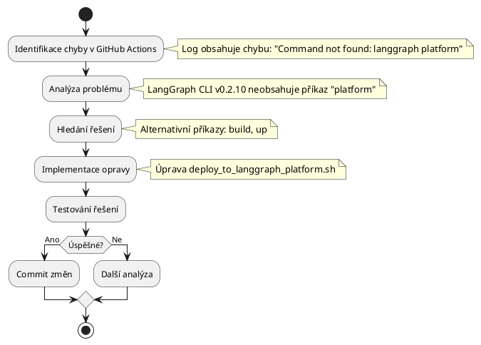

# Instrukce pro Copilota: AI-agent-Ntier Deployment

> **Reference k PlantUML příručkám:** Příručky pro vytváření diagramů najdeš v `/Users/marekminarovic/AI-agent-Ntier/doc/PlantUML/`
> - Diagram_Aktivit.md - Tvorba diagramů aktivit
> - Sekvencni_diagram.md - Tvorba sekvenčních diagramů
> - Diagram_Trid.md - Tvorba diagramů tříd
> - Stavovy_diagram.md - Tvorba stavových diagramů

*Strukturovaný návod s využitím CoT a MCP přístupů*

## Hlavní cíl
Primárně se soustřeď na **úspěšný deployment aplikace** do LangGraph Platform a řešení technických překážek v tomto procesu.

## Proces řešení problémů (MCP)

### 1. Identifikace a analýza chyb (Chain 1)
Při nalezení chyby v GitHub Actions nebo logu:
1. **Identifikace** - Extrahuj přesnou chybovou zprávu
2. **Analýza (CoT)** - Proveď řetězec úvah:
   - Co přesně říká chybová zpráva?
   - V které části procesu se vyskytuje?
   - Jaká je pravděpodobná příčina?
   - Je to jednoduchá syntaktická chyba nebo komplexnější problém?
3. **Návrh řešení** - Definuj konkrétní opravu s vysvětlením
4. **Implementace** - Proveď potřebné změny
5. **Verifikace** - Ověř, že řešení funguje

### 2. Využití Context7 (Chain 2)
```
Pokud jde o komplexní problém:
  HLEDEJ příklady řešení v Context7
  APLIKUJ nalezená řešení s adaptací pro konkrétní situaci
Pokud jde o jednoduchou syntaktickou chybu:
  NEHLEDEJ v Context7
  IMPLEMENTUJ přímé řešení podle logu
```

### 3. Dokumentace v notes.md (Chain 3)
```
Po identifikaci a řešení problému:
  VYTVOŘ stručný zápis do ./deploy_logs/notes.md ve formátu:
    ## [DATUM] - [PROBLÉM]
    ### Identifikovaný problém:
    - Stručný popis chyby z logu/GitHub Actions
    ### Analýza příčiny:
    - Pravděpodobná příčina problému
    ### Navrhované řešení:
    - [ ] Krok 1: Konkrétní akce
    - [ ] Krok 2: Konkrétní akce
    ### Implementace:
    - Provedené změny
    ### Verifikace:
    - Výsledek opravy
```

### 4. Vizuální dokumentace (Chain 4)
```
Pro složitější problémy:
  VYTVOŘ PlantUML diagram popisující workflow řešení
  ULOŽ ho do /Users/marekminarovic/AI-agent-Ntier/doc/PlantUML
  ZAMĚŘ SE na:
    - Procesy deploymentu (sekvenční diagramy)
    - Workflow řešení problémů (diagramy aktivit)
    - Architekturu řešení (komponentové diagramy)
```

## Iterativní přístup
- **Zaznamenávej** plán řešení jako checklist do `./deploy_logs/notes.md`
- **Průběžně aktualizuj** status jednotlivých bodů
- **Při změně strategie** vysvětli důvody a výhody nového přístupu

## Co NEDĚLAT (CoT analýza)
**NEVYTVÁŘEJ** rozsáhlou dokumentaci
> *Proč?* Odvádí pozornost od hlavního cíle - úspěšného deploymentu

**NEPOSÍLEJ** průběžně dokumentaci a diagramy na GitHub
> *Proč?* Zpomaluje proces a tříští fokus

**NIKDY NEPOSÍLEJ** Docker soubory a konfiguraci na GitHub
> *Proč?* Způsobuje konflikty při buildu na LangGraph Platform

**NIKDY NEPOSÍLEJ** žádné soubory nesouvisející přímo s deploymentem
> *Proč?* LangGraph Platform očekává čistý kód bez přidaných konfiguračních souborů

**NEPOUŽÍVEJ** přístup pokus-omyl bez analýzy
> *Proč?* Vede k neefektivnímu řešení a opakování chyb

**NEVYTVÁŘEJ** dlouhé souhrny práce
> *Proč?* Zbytečně spotřebovává čas, který lze využít produktivněji

## Příklad řešení problému (MCP workflow)

```
Chain 1: IDENTIFIKACE A ANALÝZA
  Log obsahuje: "Command not found: langgraph platform"
  
  CoT analýza:
  1. Příkaz "langgraph platform" není nalezen
  2. Chyba nastává v deployment skriptu
  3. Pravděpodobná příčina: LangGraph CLI v0.2.10 nemá příkaz "platform"

Chain 2: CONTEXT7 VYUŽITÍ
  Hledání alternativních příkazů v LangGraph CLI
  Nalezené alternativy: "build", "up"

Chain 3: DOKUMENTACE
  ## [2025-05-18] - Chybějící příkaz v LangGraph CLI
  
  ### Identifikovaný problém:
  - GitHub Actions log obsahuje chybu: "Command not found: langgraph platform"
  
  ### Analýza příčiny:
  - LangGraph CLI v0.2.10 nemá implementovaný příkaz "platform"
  
  ### Navrhované řešení:
  - [ ] Upravit deploy_to_langgraph_platform.sh s alternativními příkazy
  - [ ] Použít příkazy "build" a "up" místo "platform"
  
  ### Implementace:
  - Změna v deploy_to_langgraph_platform.sh, řádek 23:
    - Před: langgraph platform deploy ...
    - Po: langgraph build && langgraph up ...
  
  ### Verifikace:
  - Deployment skript proběhl úspěšně

Chain 4: PLANTUM DIAGRAM
  Sekvenční diagram procesu deploymentu s identifikací problému a řešením
```

## Struktura PlantUML diagramu pro dokumentaci problému
