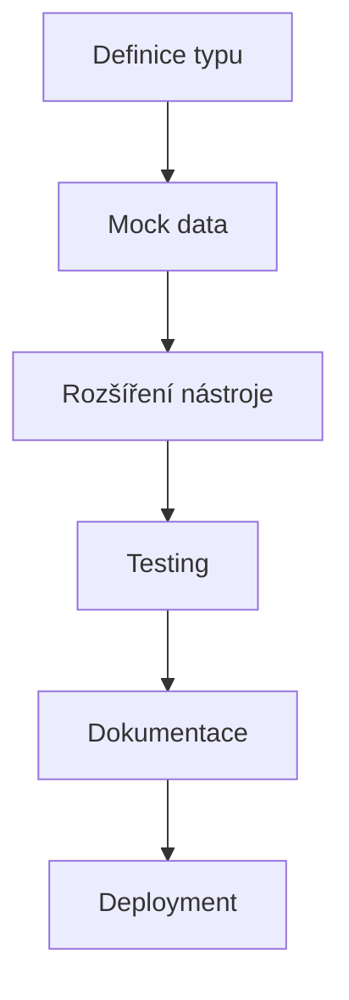
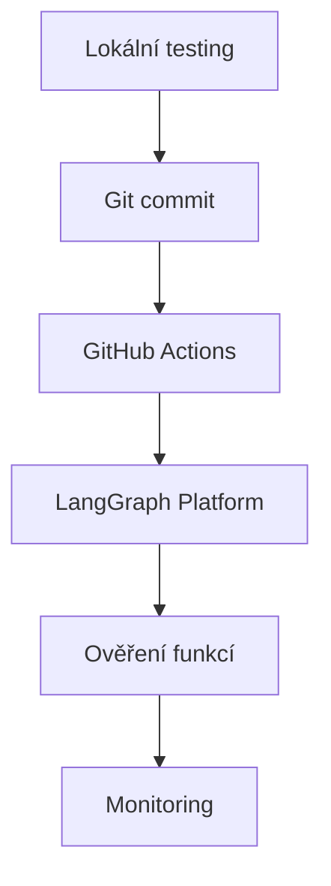
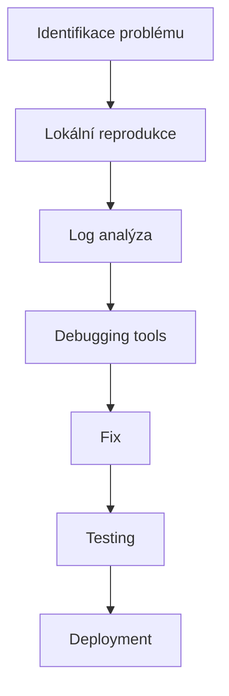

# Memory Agent - LangGraph Platform Dokumentace

Kompletní dokumentace pro vývoj a nasazení Memory Agent aplikace na LangGraph Platform.

## 📖 Přehled dokumentace

Tato dokumentace poskytuje komplexní návody pro vývojáře, kteří chtějí rozšiřovat a udržovat Memory Agent aplikaci postavené na LangGraph Platform.

### 🎯 Pro koho je určena

- **Backend vývojáři** - rozšiřování aplikace o nové funkce
- **DevOps týmy** - nasazování a monitoring aplikace
- **Product managery** - porozumění možnostem a omezeními
- **QA týmy** - testování a validace nových funkcí

## 📚 Dokumentace podle kategorií

### 🔧 Vývojářské návody

| Dokument | Účel | Náročnost |
|----------|------|-----------|
| [**LangGraph Development Guide**](./langgraph_development_guide.md) | Hlavní návod pro rozšiřování aplikace | ⭐⭐ |
| [**Extending Analysis Types**](./extending_analysis_types.md) | Přidávání nových typů analýz | ⭐⭐⭐ |
| [**LangGraph Best Practices**](./langgraph_best_practices.md) | Osvědčené postupy a pokročilé techniky | ⭐⭐⭐ |

### 🚀 Deployment a Platform

| Dokument | Účel | Náročnost |
|----------|------|-----------|
| [**LangGraph Platform Integration**](./langgraph_platform_integration.md) | Propojení s LangGraph Platform | ⭐⭐ |
| [**Deployment Guide**](./deployment_guide.md) | Komplexní deployment proces | ⭐⭐ |

### 🔍 Analýza a architektura

| Dokument | Účel | Náročnost |
|----------|------|-----------|
| [**Analýza typů analýz**](./Analyza_typu_analyz.md) | Implementace různých typů analýz | ⭐⭐ |
| [**Architecture**](./architecture.md) | Architektura aplikace | ⭐ |
| [**Project Structure**](./project_structure.md) | Struktura projektu | ⭐ |

### 🐛 Troubleshooting a Support

| Dokument | Účel | Náročnost |
|----------|------|-----------|
| [**LangGraph Troubleshooting**](./langgraph_troubleshooting.md) | Řešení problémů a debugging | ⭐⭐⭐ |
| [**Common Deployment Issues**](./common_deployment_issues.md) | Časté deployment problémy | ⭐⭐ |

### ⚡ Rychlé odkazy

| Potřebuji | Dokument | Sekce |
|-----------|----------|-------|
| Přidat nový typ analýzy | [Extending Analysis Types](./extending_analysis_types.md) | Krok za krokem guide |
| Opravit deployment chybu | [Troubleshooting](./langgraph_troubleshooting.md) | Deployment problémy |
| Optimalizovat výkon | [Best Practices](./langgraph_best_practices.md) | Performance optimization |
| Přidat nový nástroj | [Development Guide](./langgraph_development_guide.md) | Rozšiřování aplikace |
| Nastavit monitoring | [Best Practices](./langgraph_best_practices.md) | Monitoring a alerting |

## 🚀 Rychlý start

### Pro nové vývojáře

1. **Začněte zde**: [LangGraph Development Guide](./langgraph_development_guide.md)
2. **Přečtěte si**: [Analýza typů analýz](./Analyza_typu_analyz.md)
3. **Prostudujte**: [Best Practices](./langgraph_best_practices.md)

### Pro deployment

1. **Platform setup**: [LangGraph Platform Integration](./langgraph_platform_integration.md)
2. **Deployment proces**: [Deployment Guide](./deployment_guide.md)
3. **Troubleshooting**: [Common Issues](./common_deployment_issues.md)

### Pro rozšiřování funkcí

1. **Nový typ analýzy**: [Extending Analysis Types](./extending_analysis_types.md)
2. **Nové nástroje**: [Development Guide](./langgraph_development_guide.md#rozšiřování-aplikace)
3. **Testing**: [Best Practices](./langgraph_best_practices.md#testing-strategies)

## 🏗️ Architektura na vysoké úrovni

```
┌─────────────────┐    ┌──────────────────┐    ┌─────────────────┐
│   User Query    │───▶│   LangGraph      │───▶│   Analysis      │
│                 │    │   Agent          │    │   Results       │
└─────────────────┘    └──────────────────┘    └─────────────────┘
                              │
                              ▼
                       ┌──────────────────┐
                       │   Memory Agent   │
                       │   - analyzer.py  │
                       │   - tools.py     │
                       │   - state.py     │
                       └──────────────────┘
                              │
                              ▼
                       ┌──────────────────┐
                       │   Mock Data      │
                       │   - Companies    │
                       │   - Financials   │
                       │   - Relationships│
                       └──────────────────┘
```

## 📊 Aktuální stav aplikace

### ✅ Implementované funkce

- **3 typy analýz**: General, Risk Comparison, Supplier Analysis
- **LangGraph Agent**: React pattern s create_react_agent
- **Mock data connector**: MockMCPConnector pro testovací data
- **State management**: Robustní state management s reducery
- **Error handling**: Základní error handling a logging
- **Platform integration**: Nasazení na LangGraph Platform

### 🔧 Současná architektura

- **Model**: OpenAI GPT-4 (string syntax)
- **Tools**: Jeden hlavní nástroj `analyze_company`
- **Checkpointer**: InMemorySaver pro development
- **Data**: JSON mock data v `mock_data_2/`

### 📈 Možnosti rozšíření

1. **Nové typy analýz** - Market analysis, Financial analysis, atd.
2. **Více nástrojů** - Specializované nástroje pro různé domény
3. **Async processing** - Pro lepší performance
4. **Real data integration** - Napojení na reálné datové zdroje
5. **Advanced workflows** - Custom graph patterns pro komplexní use-casy

## 🎯 Workflow pro běžné úkoly

### Přidání nového typu analýzy



**Detailní postup**: [Extending Analysis Types](./extending_analysis_types.md)

### Deployment nové verze



**Detailní postup**: [Deployment Guide](./deployment_guide.md)

### Debugging problému



**Detailní postup**: [Troubleshooting Guide](./langgraph_troubleshooting.md)

## 🔗 Externí zdroje

### LangGraph dokumentace
- [LangGraph Official Docs](https://langchain-ai.github.io/langgraph/)
- [LangGraph Platform](https://platform.langgraph.com/docs)
- [LangChain Documentation](https://python.langchain.com/)

### Development resources
- [Python Best Practices](https://realpython.com/python-best-practices/)
- [Pytest Documentation](https://docs.pytest.org/)
- [Pydantic Documentation](https://docs.pydantic.dev/)

### Platform resources
- [GitHub Actions](https://docs.github.com/en/actions)
- [Docker Documentation](https://docs.docker.com/)

## 🤝 Přispívání

### Přidání nové dokumentace

1. Vytvořte nový `.md` soubor v `doc/` adresáři
2. Přidejte odkaz do tohoto indexu
3. Aktualizujte příslušné cross-reference odkazy
4. Otestujte všechny odkazy

### Aktualizace existující dokumentace

1. Udržujte konzistentní formátování
2. Přidejte datum poslední aktualizace
3. Aktualizujte související dokumenty
4. Otestujte všechny příklady kódu

### Style guide

- **Headings**: Používejte `#`, `##`, `###` hierarchicky
- **Code blocks**: Vždy specifikujte jazyk
- **Links**: Preferujte relativní odkazy
- **Příklady**: Ověřte, že všechny příklady fungují

## 📞 Support

### Pro technické otázky
- **Issues**: GitHub Issues pro bug reports
- **Discussions**: GitHub Discussions pro obecné otázky
- **Documentation**: Přidejte do této dokumentace

### Pro deployment problémy
1. Zkontrolujte [Troubleshooting Guide](./langgraph_troubleshooting.md)
2. Ověřte [Common Issues](./common_deployment_issues.md)
3. Kontaktujte tým pro další pomoc

---

**Naposledy aktualizováno**: 2025-01-31  
**Verze dokumentace**: 1.0  
**Aplikace verze**: Memory Agent PoC3